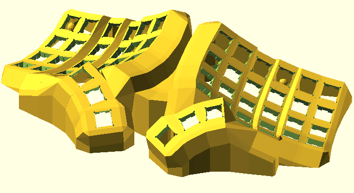

+++
title = "My Keyboard Evolution"
date = 2022-03-18T15:34:57+01:00
tags = ['keyboards']
draft = true
+++

## TL;DR
This is my historically ordered journey into ergonomic keyboards. I try to explain the background of the reasons for their choice, the advantages and limitations.

My main work on computers is coding, and I like terminals/consoles and try avoid using the mouse as much as possible.

From IBM model M to dactyl split ortho keyboard for ergonomics and fun. I am still an QWERTY but slowly moving to [COLMAK DH](https://colemakmods.github.io/mod-dh/keyboards.html#matrix-keyboards).

It was an evolution with multiple small changes, today I advice for the fast jump into an split ortho keyboard.

## IBM model M
I directly started my computer life at university with the [IBM model M](https://en.wikipedia.org/wiki/Model_M_keyboard) on workstations. 
I was lucky enough to get one of these keyboards and really liked it, the sound (first and foremost to mention), the feel, the size and the aura.
Luckily, Colleagues endured the keyboard. 

By the time I couldn't use it any longer, because of the PS2 adapter and the missing META key. The META key sounds odd, but I am used to re-arrange windows  in combination with cursor keys. 

In 2018 I bought a [Soarer's Converter](https://deskthority.net/viewtopic.php?f=7&t=2510&start=) to have an programmable USB adapter, where I exchanged the Pause key to the META key. I think I never used the Pause key in the last 20 years...

I switched to a large company with an open-plan office and left the model M at home. 

Interestingly, recently I pimped the model M with an [yacobo](https://github.com/sje-mse/yacobo) replacement controller to have an internal USB connection and fully programmable [QMK](https://docs.qmk.fm) support.

## Matias Ergopro

https://matias.ca/ergopro/pc/

https://matias.ca/switches/quiet/

## Testing boards

### Ergodox

* red Keycaps
* first QMK contact 
* played only around 
* couldnt get into ortho and thumbusage

### 

### DZ60 
* first not fullsize keyboard
* switch to US and [US international](https://en.wikipedia.org/wiki/QWERTY#US-International)
* start soldering
* modivy 
* Gateron Browns

## keebio Quefrency rev2
* https://keeb.io/collections/quefrency-split-staggered-65-keyboard

## Sofle V1
[sofle](https://josefadamcik.github.io/SofleKeyboard/)
* Zealios Switch (V2) 67g or Kaihl White

## Pteron 56
* https://github.com/FSund/pteron-keyboard
* Gateron Silent Brown

## Dactyl / Scylla
* https://bastardkb.com/scylla
* Gazzew Boba U4 Silent Tactile Switch 62g

## Cocofly
* https://github.com/vlkv/chocofly
* white chocs
* JLPCB 
* EVQ WGD0001 barrel encoder  (aliexpress only)

## Dactyl monoblock
* https://github.com/joshreve/dactyl-keyboard/pull/79
<!--    -->

text davor


<!--  {{/*  < imageresize file="/photos/chicago-us/chicago-us.jpg" opts="366x200"  >  */}} --> 

und es geht weiter